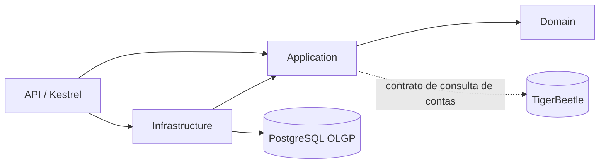

# Arquitetura

As setas sólidas indicam dependências implementadas. O adaptador TigerBeetle permanece
pendente. Domain contém as invariantes; Application declara portas; Infrastructure
implementa EF Core; Api configura DI e Kestrel. Não há endpoints de cadastro nesta sprint.

## Dados relacionais

| Schema/tabela | Responsabilidade |
| --- | --- |
| `olgp.participants` | Herança TPH, tipo, UUIDv4, datas UTC, KYC/AML, idempotência e perfis |
| `olgp.pix_keys` | Tipo, valor e referência DICT associados à pessoa singular |
| `olgp.legal_representatives` | CPF, nome e função dos representantes da empresa |
| `security.authentication_profiles` | Issuer/subject do IdP, referência MFA e identificador WebAuthn |
| `security.initiator_integrations` | Certificado público mTLS, expiração, referência da chave privada, token endpoint, JWKS DPoP e algoritmo |
| `security.webhook_configurations` | URL HTTPS e chave pública ECDSA para verificar retornos da empresa |
| `security.participant_permissions` | Permissões explícitas por participante |
| `routing.settlement_routes` | Vínculo exclusivo entre um cliente e um ID de conta no TigerBeetle |

O discriminador `kind` distingue Individual, Corporate e PaymentInitiator. CHECKs
exigem os campos do subtipo e impedem campos demográficos dos demais subtipos.
Índices únicos protegem CPF, CNPJ, organização ITP e chave de idempotência.
Dependentes usam FK `(participant_id, participant_kind)` → `(id, kind)`; CHECKs
limitam o subtipo permitido. Assim, alterar o discriminador na tabela dependente
não permite vincular uma conta a um ITP ou MFA a uma empresa.

Os identificadores TigerBeetle são armazenados como texto decimal canônico de até
39 dígitos, validados no domínio e no PostgreSQL. Não são UUIDs nem números de ponto
flutuante. Zero e o máximo UInt128 são reservados e rejeitados.

## Integração futura

`ILedgerAccountDirectory` reserva a porta de consulta de existência da conta. A
próxima implementação deve consultar o TigerBeetle antes de ativar um vínculo.
A infraestrutura local tem uma réplica em modo development. Isso não oferece
redundância nem o perfil de durabilidade de um cluster de produção.

Não existe transação distribuída entre PostgreSQL e TigerBeetle. A futura jornada
de pagamentos precisa de IDs estáveis, reenvio idempotente e reconciliação explícita.
A chave única atual protege cadastro de participante; ainda não armazena hash de
requisição, resultado anterior, escopo por solicitante ou estado de processamento.

Redis está disponível como serviço auxiliar opcional, sem dependência da API e sem
dados persistentes. Não é fonte de verdade para idempotência nem estado financeiro.
Webhooks e DICT são configurações locais, sem comunicação externa nesta sprint.

## Referências

- [Herança no EF Core](https://learn.microsoft.com/en-us/ef/core/modeling/inheritance)
- [Npgsql para EF Core 10](https://www.npgsql.org/efcore/release-notes/10.0.html)
- [TigerBeetle em Docker](https://docs.tigerbeetle.com/operating/deploying/docker/)
- [Arquitetura com TigerBeetle](https://docs.tigerbeetle.com/coding/system-architecture/)
